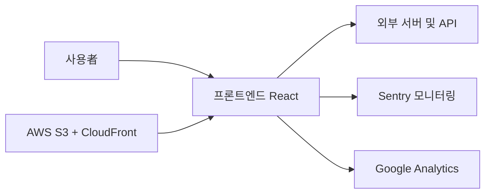

# 💌 Catch-Letter

<p align="center"></p>

> 그림으로 마음을 전하는 비밀 편지

<p align="center">🔗 <a href="https://catchletter.kr/">Catch-Letter 서비스</a></p>

<br>

## 📮 서비스 소개

친구들에게 그림으로 마음을 전할 수 있는 익명 우체통 서비스예요.

가볍게 웃기고 싶거나 고마운 마음을 전하고 싶을 때, 혹은 어색한 친구와 부담 없이 소통하고 싶을 때 쓰면 좋아요.

- 가입 없이 바로 쓸 수 있어요
- 회사나 학교에서도 가볍게 즐길 수 있어요
- 그림을 맞혀야만 편지를 볼 수 있어서 게임처럼 재미있어요

<br>

## 📱 사용 방법

1️⃣ 우체통 만들기 - 나만의 우체통 이름을 정하고 비밀번호를 설정해요.

2️⃣ 친구들에게 공유하기 - 친구들에게 우체통 링크를 SNS나 문자 등으로 공유해주세요.

3️⃣ 친구의 그림 편지 - 친구는 그림과 편지를 함께 남겨요. (로그인 없이 바로!)

4️⃣ 그림 맞히고 편지 열기 - 그림의 정답을 맞혀야만 친구의 편지를 볼 수 있어요.

<br>

## 🖥️ 기술 스택

### 🛠️ Tech Stack

- React, TypeScript, Vite
- TanStack Query, Axios, Zustand
- Emotion
- Konva, Matter.js
- i18next

### 📈 Monitoring

- Sentry
- Google Analytics (GA)

### ⚙️ Dev Tools

- ESLint, Prettier
- GitHub Actions, AWS S3, CloudFront

<br>

## ✨ 주요 기능 상세

### 📮 우체통 생성
- 나만의 우체통 이름 설정
- 비밀번호 설정 및 관리
- 공유 링크 생성

### 🎨 그림 편지 작성
- 캔버스를 활용한 그림 그리기
- 익명 편지 작성 및 전송
- 다양한 팔레트와 폰트 제공

### 🧩 그림 맞히기
- 친구가 그린 그림 확인
- 정답 입력 및 힌트 제공
- 정답 성공 시 편지 내용 열람

<br>

## 🧭 시스템 아키텍처



<br>

## 📅 개발 기간

2024-12-20 ~ 2026-08-13

<br>

## 📁 폴더 구조

```text
.
├── .github/          # 깃허브 이슈 템플릿 및 워크플로우 설정
├── .storybook/       # 스토리북 설정 및 디자인 시스템
├── src/              # 소스 코드 루트
│   ├── api/          # API 통신 관련 코드
│   ├── app/          # 앱 전역 설정, 에러, 모델 및 UI
│   ├── assets/       # 이미지, 폰트 등의 정적 자산
│   ├── components/   # 공통 및 기능별 컴포넌트
│   ├── hooks/        # 커스텀 훅
│   ├── pages/        # 페이지 단위 컴포넌트
│   ├── shared/       # 공통 API, 설정, UI, 유틸리티
│   ├── store/        # 상태 관리 스토어
│   ├── styles/       # 스타일 파일
│   └── types/        # 타입 정의
└── package.json      # 패키지 설정 파일
```

<br>

## 👩🏻‍💻 팀원

| FE | FE | FE | BE |
| :---: | :---: | :---: | :---: |
| **김수민** | **박지영** | **손성오** | **유남균** |
| <br>[@ssuminii](https://github.com/ssuminii) | <br>[@jizerozz](https://github.com/jizerozz) | <br>[@Sonseongoh](https://github.com/Sonseongoh) | <br>[@namgyun1201](https://github.com/namgyun1201) |

<br>

## 담당 업무

### 김수민
- AWS S3 배포 워크플로우 설정 및 관리
- Sentry API 에러 레벨 분류 추가 및 SPA 라우팅 리라이트 설정
- 편지함 자동 호출 및 낙관적 업데이트 적용

### 박지영
- 소셜 공유 모달 아이콘 스켈레톤 UI 적용
- 이벤트 모달 및 알림 기능 구현
- 폰트 최적화 및 DOM nesting 경고 해결

### kimpra
- 세션 스토리지를 활용한 액세스 토큰 저장 방식 수정
- 튜토리얼 캐러셀 및 툴팁 번역 기능 구현
- separated input 유효성 검사 및 키보드 이동 로직 개선

### 손성오
- 타이머 리렌더링 최적화 및 힌트 노출 로직 수정
- separated input 백스페이스 및 패딩 속성 개선
- 윈도우 환경 문자열 깨짐 및 배경색 적용 오류 수정

<br>

## 🚀 시작하기

```bash
npm install
npm run dev
```