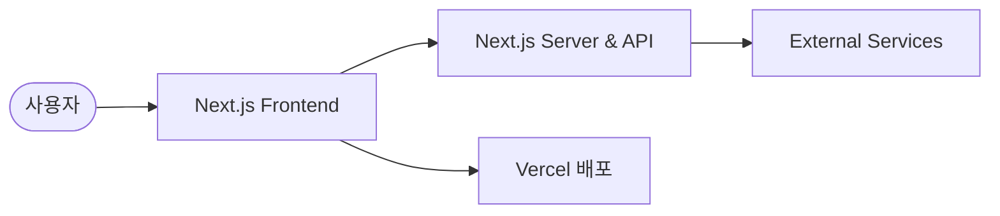

# Next.js

<p align="center"></p>

> The React Framework

<p align="center">🔗 <a href="https://nextjs.org">Next.js 서비스</a></p>

## 💡 서비스 소개

모던 웹 애플리케이션을 더 빠르고 효율적으로 만들 수 있도록 돕는 프레임워크예요.
최신 웹 기술을 활용해 성능 좋은 풀스택 서비스를 구축하고 싶은 개발자가 쓰면 좋아요.
- 최신 React 기능을 확장해서 풀스택 웹 애플리케이션을 만들 수 있어요
- Rust 기반의 강력한 도구를 활용해 빠른 빌드를 지원해요
- 직관적인 라우팅과 렌더링 방식을 제공해요

<br>

## 🚀 사용 방법

1️⃣ pnpm을 이용해 프로젝트에 필요한 의존성을 설치해요.

2️⃣ 개발 서버를 실행해서 코드를 수정하고 결과를 실시간으로 확인해요.

3️⃣ 프로덕션 빌드를 생성하고 서비스를 배포해요.

<br>

## 🛠️ 기술 스택

### 💻 Frontend & Backend
- React, React DOM, TypeScript
- Next.js, Express, SWR

### ⚙️ Dev Tools & Build
- Turbo, pnpm, Webpack, SWC
- ESLint, Prettier, Husky

<br>

## ✨ 주요 기능 상세

### 🧭 라우팅 및 렌더링
- App Router와 Pages Router를 통한 페이지 경로 관리
- 서버 컴포넌트와 클라이언트 컴포넌트 조합 지원
- 동적 라우팅 및 레이아웃 설정 처리

### ⚡ 성능 최적화
- 이미지 최적화 및 폰트 로딩 최적화
- Turbopack 기반의 빠른 번들링과 빌드
- 정적 및 동적 캐싱 처리

<br>

## 🏗️ 시스템 아키텍처



<br>

## 📅 개발 기간

2016-10-05 ~ 2026-10-02

<br>

## 📁 폴더 구조

```text
nextjs-project/
├── .github/          # GitHub Actions 및 템플릿 설정
├── apps/             # 번들 분석기 등 애플리케이션 패키지
├── bench/            # 성능 벤치마크 및 테스트 코드
├── crates/           # Rust 기반 코어 및 컴파일러 모듈
├── docs/             # 사용자 가이드 및 API 문서
├── evals/            # AI 에이전트 평가 및 마이그레이션 테스트
└── package.json      # 프로젝트 설정 및 의존성 관리
```

<br>

## 👥 팀원

| FE | BE | Contributor | Contributor | Contributor | Contributor |
| :---: | :---: | :---: | :---: | :---: | :---: |
| **JJ Kasper** | **Tim Neutkens** | **Tobias Koppers** | **Jiachi Liu** | **Joe Haddad** | **Sebastian "Sebbie" Silbermann** |
| <br>[@ijjk](https://github.com/ijjk) | <br>[@timneutkens](https://github.com/timneutkens) | <br>[@sokra](https://github.com/sokra) | <br>[@huozhi](https://github.com/huozhi) | <br>[@Timer](https://github.com/Timer) | <br>[@eps1lon](https://github.com/eps1lon) |

<br>

## 🎯 역할 분담

### JJ Kasper
- 다이렉트 라우트 핸들러를 위한 setHeader 패치 적용
- 미들웨어 매칭 및 앱 요청 URL 정규화 처리
- 어댑터 설정 사용에 대한 텔레메트리 추가

### Tim Neutkens
- 앱 라우터 로케일 경로 매칭 수정
- 웹 바이탈 업그레이드 및 소프트 내비게이션 리포트
- 터보팩 워커 청크 로딩 수정

### Tobias Koppers
- 빌드를 위한 터보팩 내보내기 이름 난독화 기본 활성화
- 터보팩 패키지 디렉토리의 프로젝트 전체 트레이스 방지
- 프로덕션 환경에서 각 레이아웃 세그먼트 청크 분할

### Jiachi Liu
- 에러 발생 시 포워드된 에러의 소유자 스택 포함
- MCP 엔드포인트 응답을 JSON으로 변경
- 서버 액션 로깅 기능 추가

### Joe Haddad
- 커스텀 Vary 헤더 유지 수정
- CSSNano 및 PostCSS 버전 업그레이드
- 웹팩 5 자동 활성화 처리

### Sebastian "Sebbie" Silbermann
- 응답 캐시 키를 소스 라우트로 범위 한정
- Next 데이터 경로 대소문자 구분 일치 처리
- 넥스트 이미지 외부 이미지 페칭 시 DNS 고정

<br>

## 🚀 시작하기

```bash
pnpm install
pnpm dev
```