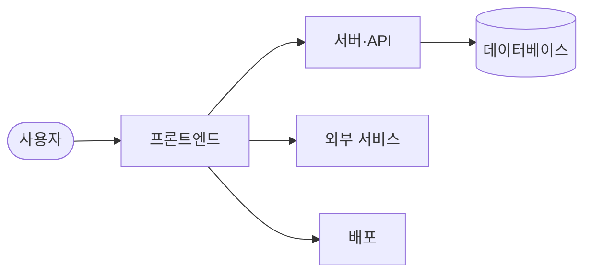

# React

<p align="center">🔗 <a href="https://react.dev">React 서비스</a></p>

> The library for web and native user interfaces.

<br>

## 🎯 서비스 소개

웹 및 네이티브 사용자 인터페이스를 구축하기 위한 라이브러리예요.

복잡한 사용자 인터페이스를 효율적이고 직관적으로 개발하고 싶은 개발자가 사용하면 좋아요.

- 애플리케이션의 각 상태에 맞는 간단한 뷰를 설계하여 상호작용하기 쉬운 UI를 만들 수 있어요
- 자체 상태를 관리하는 캡슐화된 컴포넌트를 조합하여 복잡한 UI를 구축할 수 있어요
- 기존 기술 스택을 변경하지 않고 필요한 부분만 점진적으로 도입하여 사용할 수 있어요

<br>

## 🚀 사용 방법

React를 프로젝트에 도입하려면 패키지 관리자를 통해 설치하고 활용할 수 있어요.

1️⃣ 프로젝트 루트 디렉토리에서 패키지를 설치해요.

2️⃣ 컴포넌트 파일을 생성하고 사용자 인터페이스를 작성해요.

3️⃣ 렌더링할 루트 요소를 지정하고 컴포넌트를 화면에 렌더링해요.

```jsx
import { createRoot } from 'react-dom/client';

function HelloMessage({ name }) {
  return <div>Hello {name}</div>;
}

const root = createRoot(document.getElementById('container'));
root.render(<HelloMessage name="Taylor" />);
```

<br>

## 🛠️ 기술 스택

### 🛠️ Core & Language
- JavaScript, TypeScript

### ⚙️ Build & Dev Tools
- Rollup, Babel, ESLint, Prettier

### 🧪 Testing
- Jest

<br>

## ✨ 주요 기능 상세

### 🧩 UI 컴포넌트 관리
- 독립적인 상태를 가진 컴포넌트 작성
- 컴포넌트 간의 원활한 데이터 전달
- DOM 조작 없이 선언적인 뷰 구성

### ⚡ 렌더링 및 상태 최적화
- 데이터 변경 시 효율적인 컴포넌트 업데이트
- 지연된 값 처리를 통한 성능 최적화
- 서버 사이드 렌더링 지원

<br>

## 🏗️ 시스템 아키텍처



<br>

## 📅 개발 기간

2013-05-24 ~ 2026-10-01

<br>

## 📂 폴더 구조

```text
📦 
 ┣ 📂 compiler/ (컴파일러 관련 소스 및 패키지)
 ┣ 📂 packages/ (React 코어 및 핵심 패키지 모음)
 ┣ 📂 scripts/ (빌드, 테스트, 배포 스크립트)
 ┣ 📜 CHANGELOG.md (변경 사항 기록)
 ┣ 📜 LICENSE (라이선스 정보)
 ┗ 📜 package.json (프로젝트 설정 및 의존성)
```

<br>

## 👥 팀원

| Sebastian Markbåge | Paul O’Shannessy | dan |
| :---: | :---: | :---: |
| **Sebastian Markbåge**<br><br>[@sebmarkbage](https://github.com/sebmarkbage) | **Paul O’Shannessy**<br><br>[@zpao](https://github.com/zpao) | **dan**<br><br>[@gaearon](https://github.com/gaearon) |

| Andrew Clark | Sophie Alpert | Joseph Savona |
| :---: | :---: | :---: |
| **Andrew Clark**<br><br>[@acdlite](https://github.com/acdlite) | **Sophie Alpert**<br><br>[@sophiebits](https://github.com/sophiebits) | **Joseph Savona**<br><br>[@josephsavona](https://github.com/josephsavona) |

<br>

## 💻 역할 분담

### Sebastian Markbåge
- Fiber 및 Flight 아키텍처 개선
- 제스처 및 뷰 전환 이벤트 지원 추가
- 비동기 상태 업데이트 최적화

### Paul O’Shannessy
- 릴리즈 관리 도구 및 명령어 구현
- CI 및 문서 업데이트 작업
- 코드 오브 콘덕트 및 기여 가이드 도입

### dan
- Flight 모듈 문자열 최적화 및 디버그 정보 개선
- 컴파일러 및 리프레시 관련 버그 수정
- propTypes 검증 로직 제거

### Andrew Clark
- Flight 서버 레퍼런스 및 프로토콜 확장
- Fiber 트리의 컨텍스트 전파 및 오류 복구 수정
- 프리렌더링 구현 및 버전 관리

### Sophie Alpert
- Fiber 및 Fast Refresh 관련 뮤테이션 감지 개선
- 하이드레이션 및 입력 필드 상태 동기화 수정
- 에러 메시지 개선 및 Strict Mode 지원

### Joseph Savona
- React 컴파일러를 Rust로 포팅
- 컴파일러 파이프라인의 오류 허용 인프라 구축
- 검증 패스 및 오류 누적 로직 개선

<br>

## 🏁 시작하기

```bash
yarn install
yarn build
```