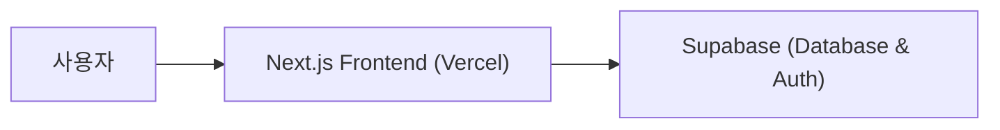

# Write-Me

<p align="center"></p>

> 개발자를 위한 README 생성 도구예요.

<p align="center">🔗 <a href="https://write-me-eta.vercel.app">Write-Me 서비스</a></p>

<br>

## 💡 서비스 소개

개발자가 쉽고 빠르게 프로젝트 설명서를 만들 수 있도록 도와주는 도구예요.

프로젝트를 공유하거나 오픈소스 문서를 깔끔하게 정리하고 싶은 개발자가 편하게 쓰면 좋아요.

- 직관적인 입력 방식으로 누구나 쉽게 문서를 만들 수 있어요
- 미리보기를 통해 작성한 내용을 실시간으로 확인할 수 있어요
- 작성한 문서를 저장하고 갤러리에서 다른 사람들과 공유할 수 있어요

<br>

## 🚀 사용 방법

1️⃣ 로그인 후 새로운 프로젝트 정보를 입력해요.

2️⃣ 에디터와 미리보기 기능을 활용해 필요한 내용을 작성해요.

3️⃣ 완성된 문서를 등록하고 공유해요.

<br>

## 🛠️ 기술 스택

### 💻 Frontend
- Next.js, React, TypeScript
- Tailwind CSS, Radix UI, Lucide React

### 🗄️ Backend & State
- Supabase, TanStack Query, Zustand

<br>

## ✨ 주요 기능 상세

### 프로젝트 관리
- 프로젝트 정보 입력 및 수정
- 드래그 앤 드롭 기반 컴포넌트 정렬
- 마크다운 에디터를 활용한 문서 작성

### 갤러리 및 공유
- 작성된 README 목록 조회
- 상세 페이지를 통한 문서 확인
- 좋아요 및 커뮤니티 공유 기능

<br>

## 📊 시스템 아키텍처



<br>

## 📅 개발 기간

2025-04-20 ~ 2026-09-30

<br>

## 📁 폴더 구조

```text
├── app/          # 페이지 및 라우트 그룹 컴포넌트
├── components/   # 공통 및 UI 컴포넌트
├── hooks/        # 커스텀 훅 모음
├── lib/          # 외부 라이브러리 및 유틸리티 설정
├── stores/       # Zustand 상태 관리
└── types/        # 타입 정의
```

<br>

## 👥 팀원

| FE |
| :---: |
| **Sumin** |
| <br>[@ssuminii](https://github.com/ssuminii) |

<br>

## 📋 역할 분담

### Sumin
- Supabase 이미지 호스트 설정 및 Next.js 버전 업그레이드
- 리드미 등록 및 유효성 검사 기능 구현
- 좋아요 기능 낙관적 업데이트 적용 및 성능 최적화
- 상세 및 갤러리 페이지 서버 컴포넌트 리팩토링

<br>

## 🏁 시작하기

```bash
npm install
npm run dev
```