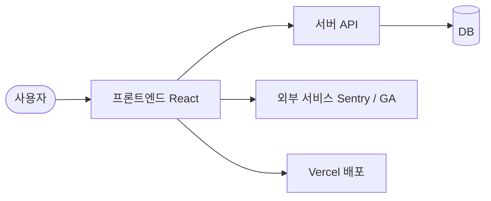

# 💌 Catch-Letter

> 그림으로 마음을 전하는 비밀 편지

<p align="center">🔗 <a href="https://catchletter.kr/">Catch-Letter 서비스</a></p>

<br>

## 📮 서비스 소개

그림으로 마음을 전할 수 있는 익명 우체통 서비스예요.

가볍게 웃기고 싶거나 고마운 마음을 전하고 싶을 때, 혹은 조금 어색한 친구와도 부담 없이 소통하고 싶을 때 쓰면 좋아요.

- 가입 없이 바로 쓸 수 있어요
- 회사나 학교에서도 가볍게 즐길 수 있어요
- 그림의 정답을 맞혀야만 편지를 볼 수 있어요
- 게임처럼 재미있게 마음을 전달할 수 있어요

<br>

## 📱 사용 방법

1️⃣ 우체통 만들기 - 나만의 우체통 이름을 정하고 비밀번호를 설정해요.

<br>

2️⃣ 친구들에게 공유하기 - 친구들에게 우체통 링크를 SNS나 문자 등으로 공유해요.

<br>

3️⃣ 친구의 그림 편지 - 친구는 로그인 없이 바로 그림과 편지를 남겨요.

<br>

4️⃣ 그림 맞히고 편지 열기 - 그림의 정답을 맞혀야만 친구의 편지를 볼 수 있어요.

<br>

## 🖥️ 기술 스택

### 🛠️ Tech Stack

- React, TypeScript, Vite
- TanStack Query, Axios, Zustand
- Emotion
- Konva, Matter.js
- i18next

<br>

### 📈 Monitoring

- Sentry
- Google Analytics

<br>

### ⚙️ Dev Tools

- ESLint, Prettier
- Vercel, GitHub Actions

<br>

## 🛠️ 주요 기능 상세

### 🎨 드로잉 캔버스

Konva와 Matter.js를 활용하여 직접 그림을 그리고 지우는 등 자유로운 드로잉 기능을 제공해요.

<br>

### 💌 편지함 및 인터랙션

다양한 폰트, 색상, 패턴을 조합하여 개성 있는 편지를 작성하고 확인할 수 있어요.

<br>

### 🔍 정답 맞히기

친구가 남긴 그림의 정답을 맞혀야만 편지 내용을 열어볼 수 있는 게임 요소를 더했어요.

<br>

## 🏗️ 시스템 아키텍처



<br>

## 📅 개발 기간

2024-12-20 ~ 2026-08-13

<br>

## 📁 폴더 구조

```text
Catch-Letter-FE
├── .github         # GitHub 템플릿 및 워크플로우 설정
├── .storybook      # 스토리북 설정 및 디자인 시스템
├── public          # 정적 리소스 파일
├── src             # 소스 코드
│   ├── api         # API 연동 모듈
│   ├── app         # 앱 전역 설정 및 에러 처리
│   ├── assets      # 이미지, 폰트 등 에셋 파일
│   ├── components  # 공통 및 기능별 UI 컴포넌트
│   ├── hooks       # 커스텀 훅
│   ├── pages       # 페이지 단위 컴포넌트
│   ├── shared      # 공용 유틸 및 UI 컴포넌트
│   ├── store       # 상태 관리 스토어
│   ├── styles      # 전역 스타일 및 테마
│   └── types       # TypeScript 타입 정의
└── package.json    # 패키지 및 의존성 설정
```

<br>

## 👥 팀원

| FE | FE | FE | FE |
| :---: | :---: | :---: | :---: |
| **김수민** | **박지영** | **손성오** | **유남균** |
| <br/> [@ssuminii](https://github.com/ssuminii) | <br/> [@jizerozz](https://github.com/jizerozz) | <br/> [@kimpra2989](https://github.com/kimpra2989) | <br/> [@namgyun1201](https://github.com/namgyun1201) |

<br>

## 💻 역할 분담

### 김수민

- Sentry 에러 레벨 분류 추가 및 Vercel SPA 라우팅 설정
- 캔버스 배경 및 팔레트 스타일 개편 및 스켈레톤 UI 적용
- 편지 전체 목록 조회 및 낙관적 업데이트 로직 리팩토링

<br>

### 박지영

- 소셜 공유 모달 아이콘 프리로드 및 이미지 압축 최적화
- 비밀번호 입력 인풋 상태 분리 및 DOM nesting 경고 해결
- 글꼴 폰트 preload 및 폰트 깜빡임 현상 방지

<br>

### 손성오

- 로그인 및 토큰 저장 방식 세션스토리지로 수정
- 튜토리얼 모달 및 캐러샐 기능 구현
- 툴팁 번역 추가 및 컴포넌트 분리

<br>

### 유남균

- 캔버스 SVG 변환 및 화이트 색상 지우개 수정
- 타이머 리렌더링 최적화 및 문자열 깨짐 현상 수정
- 비밀번호 모달 및 정답 확인 관련 버그 수정

<br>

## 🤝 협업 방식

- 기능 개발(feat), 버그 수정(fix), 문서 작성(docs), 리팩토링(refactor) 등의 커밋 컨벤션을 따릅니다.
- 이슈 템플릿과 PR 템플릿을 활용해 체계적인 코드 리뷰와 이슈 관리를 진행합니다.

<br>

## 🚀 시작하기

```bash
npm install
npm run dev
```