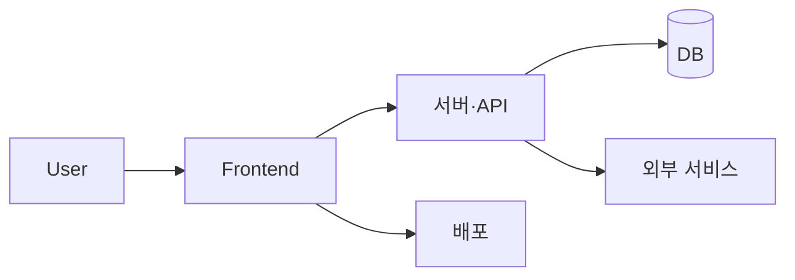

# ⚛️ react

> The library for web and native user interfaces.

<p align="center">🔗 <a href="https://react.dev">react 서비스</a></p>

## 🌐 서비스 소개

웹과 네이티브 플랫폼에서 사용자 인터페이스를 쉽게 구축할 수 있도록 돕는 자바스크립트 라이브러리에요. 화면의 상태 변화를 예측 가능하고 직관적으로 관리하고 싶은 개발자나 복잡한 사용자 인터페이스를 컴포넌트 단위로 나누어 개발하고 싶을 때 사용하기 좋아요.

* 각 상태에 맞는 단순한 뷰를 설계하면 데이터가 바뀔 때 필요한 컴포넌트만 효율적으로 갱신하고 렌더링해요.
* 자체 상태를 관리하는 독립된 컴포넌트를 조합하여 복잡한 사용자 인터페이스를 만들 수 있어요.
* 기존 기술 스택을 통째로 바꿀 필요 없이 점진적으로 도입할 수 있으며 서버와 모바일 환경에서도 활용할 수 있어요.

<br>

## 🚀 사용 방법

1️⃣ 프로젝트에서 패키지 매니저를 통해 필요한 의존성을 설치해요.

2️⃣ 컴포넌트 파일 안에서 필요한 React 모듈과 렌더링 도구를 불러와요.

```jsx
import { createRoot } from 'react-dom/client';

function HelloMessage({ name }) {
  return <div>Hello {name}</div>;
}

const root = createRoot(document.getElementById('container'));
root.render(<HelloMessage name="Taylor" />);
```

3️⃣ 컴포넌트를 DOM 컨테이너에 렌더링하여 화면에 출력해요.

<br>

## 🛠️ 기술 스택

### 📦 Language & Runtime
* JavaScript, TypeScript

### ⚙️ Build & Tooling
* Rollup, Babel, Tsup

### 🧪 Testing
* Jest, Babel Jest, Playwright

<br>

## ✨ 주요 기능 상세

### 🧩 선언형 UI 렌더링
애플리케이션의 각 상태에 맞는 간결한 뷰를 작성하면 데이터 변경 시 필요한 컴포넌트만 효율적으로 업데이트하고 렌더링해 주어 코드를 더 예측 가능하게 만들어요.

### 🧱 컴포넌트 기반 아키텍처
자체 상태를 관리하는 캡슐화된 컴포넌트를 조립하여 복잡한 사용자 인터페이스를 구축할 수 있으며 템플릿 대신 자바스크립트로 로직을 작성하여 데이터를 자유롭게 다룰 수 있어요.

### 🌐 멀티 플랫폼 지원
기존 기술 스택에 구애받지 않고 점진적으로 도입할 수 있으며 Node를 통한 서버 사이드 렌더링과 React Native를 활용한 모바일 앱 개발까지 지원해요.

<br>

## 🏗️ 시스템 아키텍처



<br>

## 📅 개발 기간

2013-05-24 ~ 2026-10-01

<br>

## 📁 폴더 구조

```text
📦 
 ┣ 📂 compiler          # 리액트 컴파일러 관련 소스 코드
 ┣ 📂 fixtures          # 다양한 테스트 및 예제 Fixture 코드
 ┣ 📂 flow-typed        # Flow 타입 정의 파일
 ┣ 📂 packages          # 코어, DOM, 리컨사이어 등 주요 패키지 모음
 ┗ 📂 scripts           # 빌드, 테스트, 릴리스 자동화 스크립트
```

<br>

## 👥 팀원

| Contributor | Contributor | Contributor | Contributor | Contributor | Contributor |
| :---: | :---: | :---: | :---: | :---: | :---: |
| **Sebastian Markbåge** | **Paul O’Shannessy** | **dan** | **Andrew Clark** | **Sophie Alpert** | **Joseph Savona** |
|  |  |  |  |  |  |
| [@sebmarkbage](https://github.com/sebmarkbage) | [@zpao](https://github.com/zpao) | [@gaearon](https://github.com/gaearon) | [@acdlite](https://github.com/acdlite) | [@sophiebits](https://github.com/sophiebits) | [@josephsavona](https://github.com/josephsavona) |

<br>

## 💼 역할 분담

### Sebastian Markbåge
* Fiber 트리 마운트 상태 확인 및 제스처 애니메이션 이벤트 로직 구현
* Flight 환경의 추가 루프 보호 및 Promise 사이클 패치 작업 수행
* 디퍼드 값 업데이트 지연 및 제스처 커밋 최적화 처리

### Paul O’Shannessy
* 코드 오브 컨덕트 업데이트 및 기여자 규약 적용
* 리액트 릴리스 매니저 초기 도입 및 관련 스크립트 작성
* 빌드 파이프라인 및 명령어 도구 개선 작업 수행

### dan
* Flight 환경에서의 반복 문자열 추출 및 중복 제거 최적화
* Fiber 구조의 탈수된 경계 관련 행 현상 수정
* 벤치마크 JSON 출력 기능 추가 및 의존성 정리

### Andrew Clark
* Flight 서버 레퍼런스 확장 및 병렬 트랜지션 기능 활성화
* Fiber 컨텍스트 전파 및 Suspense 폴백 처리 오류 수정
* 비블로킹 프레렌더링 로직 구현 및 버전 관리

### Sophie Alpert
* Fiber 트리 내 숨겨진 활동 상태에서의 뮤테이션 감지 로직 구현
* 패스트 리프레시 컴포넌트 마운트 및 비교 함수 갱신 처리
* StrictMode 내 이펙트 호출 및 체크박스 수화 오류 수정

### Joseph Savona
* 리액트 컴파일러를 Rust 언어로 포팅 작업 수행
* 컴파일러 오류 진단 및 중복 제거 로직 개선
* 허용 오차 테스트 Fixture 추가 및 파이프라인 예외 처리 보완

<br>

## 🤝 협업 방식

* `feat`, `fix`, `compiler` 등의 접두사를 활용한 커밋 컨벤션을 사용하고 있어요.
* 이슈 템플릿과 PR 템플릿을 통해 체계적인 버그 리포트와 코드 리뷰를 진행하고 있어요.

<br>

## 🏁 시작하기

```bash
yarn install
yarn build
```