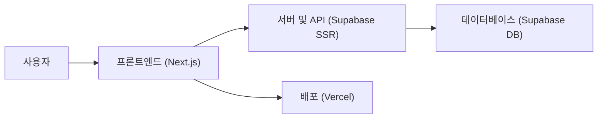

# 📝 Write-Me

> 개발자를 위한 README 생성 도구

<p align="center">🔗 <a href="https://write-me-eta.vercel.app">Write-Me 서비스</a></p>

## 💡 서비스 소개

개발자들이 프로젝트 소개 문서를 손쉽게 작성하고 관리할 수 있도록 돕는 웹 서비스예요.

평소에 멋진 프로젝트를 만들고도 README 작성에 막막함을 느끼거나, 일관된 형식으로 문서를 빠르게 정리하고 싶은 개발자가 쓰기에 좋아요.

- 직관적인 인터페이스를 통해 복잡한 마크다운 문법을 몰라도 완성도 높은 README를 만들 수 있어요
- 작성 중인 내용을 실시간으로 미리 보면서 수정할 수 있어요
- 다른 사람들이 공유한 프로젝트 문서를 구경하고 참고할 수 있어요
- 완성된 문서를 간편하게 복사하거나 내보내어 활용할 수 있어요

<br>

## 🚀 사용 방법

1️⃣ 소셜 로그인 기능을 통해 서비스에 간편하게 로그인해요.

<br>

2️⃣ 프로젝트의 기본 정보, 기술 스택, 주요 기능 등을 입력하면서 실시간 미리보기를 확인해요.

<br>

3️⃣ 완성된 README 문서를 저장하거나 갤러리에 공유하여 다른 개발자들과 소통해요.

<br>

## 🛠️ 기술 스택

### 💻 Frontend
- React, Next.js, TypeScript

<br>

### 🎨 Styling & UI
- Tailwind CSS, Radix UI, Lucide React, Next Themes

<br>

### 🗄️ Backend & State Management
- Supabase, TanStack Query, Zustand, Dnd Kit

<br>

## ✨ 주요 기능 상세

### 📝 README 작성 및 편집기
마크다운 에디터와 실시간 미리보기 기능을 제공하여 사용자가 입력하는 즉시 결과물을 확인할 수 있어요.

<br>

### 🎨 갤러리 및 커뮤니티
다른 개발자들이 작성한 프로젝트 문서를 구경하고 좋아요를 누르거나, 필요한 내용을 참고할 수 있는 공간이에요.

<br>

### 👤 프로필 및 활동 관리
사용자의 프로젝트 이력과 활동 통계를 한눈에 볼 수 있도록 프로필 관리 기능을 제공해요.

<br>

## 📈 시스템 아키텍처



<br>

## 📅 개발 기간

2025-04-20 ~ 2026-09-30

<br>

## 🗂️ 폴더 구조

```text
📦 
 ┣ 📂 .github          # 깃허브 이슈 및 PR 템플릿
 ┣ 📂 app              # 넥스트 이에스 라우터 기반 페이지 및 컴포넌트
 ┣ 📂 components       # 공통 UI 및 드래그 앤 드롭 컴포넌트
 ┣ 📂 config           # 네비게이션 및 설정 파일
 ┣ 📂 hooks            # 커스텀 훅 및 쿼리 로직
 ┣ 📂 lib              # 수파베이스 및 공통 유틸리티 라이브러리
 ┣ 📂 mocks            # 목업 데이터
 ┣ 📂 public           # 폰트, 아이콘, 로고 등 정적 자원
 ┣ 📂 stores           # 전역 상태 관리 스토어
 ┣ 📂 types            # 공통 타입 정의
 ┗ 📂 utils            # 마크다운 등 헬퍼 유틸리티
```

<br>

## 👥 팀원

| FE |
| :---: |
| **Sumin** |
|  <br> [@ssuminii](https://github.com/ssuminii) |

<br>

## 💼 역할 분담

### Sumin
- Next.js 기반의 프론트엔드 페이지 구조 설계 및 서버 컴포넌트 리팩토링 진행
- TanStack Query를 활용한 좋아요 낙관적 업데이트 및 데이터 페칭 성능 최적화 구현
- README 작성 폼의 유효성 검사 및 Supabase 이미지 업로드 기능 연동

<br>

## 🤝 협업 방식

- 기능 개발(feat), 버그 수정(fix), 스타일 수정(style), 성능 개선(perf), 리팩토링(refactor) 등의 커밋 컨벤션을 따르고 있어요.
- 이슈 템플릿과 PR 템플릿을 활용해 체계적인 문제 해결과 코드 리뷰를 진행하고 있어요.

<br>

## 🏁 시작하기

```bash
npm install
npm run dev
```